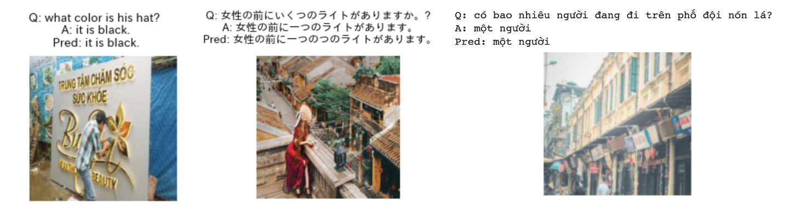

# Multilingual Visual Question Answering (mVQA)
In this project, we built three transformer-based models for multilingual visual question answering (mVQA), which is a challenging multi-modal task requiring answering questions proposed from images in multiple languages.  
Work done by [Xinwen Liu](https://github.com/Xinwen-Liu-Wendy), [Joseph Lin](https://github.com/josephhlinn)

## Dataset
We used the dataset for the VLSP 2022 EVJVQA Challenge (https://codalab.lisn.upsaclay.fr/competitions/12274), which contains 23,785 question and answer pairs (QAs) in three languages (English, Japanese, Vietanmese).

## Models
Three transformer-based models were built for this project. The first one is ViT + mT5, the second model is ViTMAE + mT5, and the third model is ViT + mBART. Codes of each model are available in the corresponding .ipynb file. 

## Reproduce experiments
All the data loading, preprocessing, model, training and evaluation codes are provided in .ipynb.

## Results
Following are the demonstration results of our model (ViT + mBART) in three languages. Q represents question, A represents answer, Pred represents prediction results from the model.

